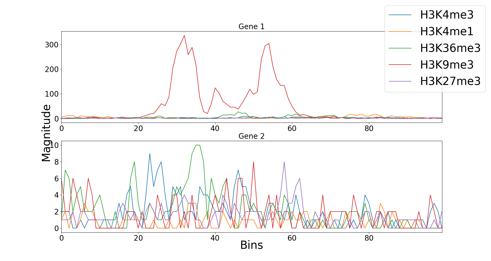

# Gene Expression Prediction Using 1D Convolution Network

This is the official repository for the paper [Gene Expression Prediction Using a Deep 1D Convolution Neural Network.](https://ieeexplore.ieee.org/document/9002669) This repository contains the basic code to rreplicate our set of experiments.

There were two sets of experiments which we ran:
* Each cell type is taken individually and a model is trained and tested upon it
* The train and validation data is mixed and only one model is trained on this entire new data set and then testing is performed individually on each cell type

### Data
The data for these experiments can be downloaded from [here.](https://zenodo.org/record/2652278) The data contains gene expression values and the five kinds of histone modifications for 56 cell types. Each cell type contains 19802 gene samples. For each gene, the region containing 10,000 base pairs surrounding the Transcription Start Site (TSS) was divided into 100 bins of 100 base pairs each and for each bin, five different modification signals were recorded.

<figure>
  
  <figcaption><p style="text-align:center">Histone modifications for one cell type</p></figcaption>
</figure>

### Model
The model created is a 1D convolutional neural network followed by a dense network. We use a 1D convolution network to map the spatial sequence of the histone modification signals. For more details please have a look at the paper.

<figure>
  
  <figcaption><p style="text-align:center">The proposed network architecture</p></figcaption>
</figure>

### Usage
There are five python files in this repository
* `Convnet.py` - This defines the model architecture along with the training and testing loops
* `data.py` - This script loads and transforms the data in a format suitable for ingestion
* `utils.py` - This describes some of the utility functions
* `roc_auc_callback.py` - This defines a area under the ROC curve callback to keep track of how the model performance changes across various epochs
* `main.py` - This is the main file which defines various hyperparameters and other configurations. It also runs a complete training and evaluation step for the data

Only the `main.py` is sufficient to train and test our model. There are various settings available in the `main.py` which can be accessed as

```
python main.py -h

usage: main.py [-h] [--epochs EPOCHS] [--batch_size BATCH_SIZE] [--lr LR] [--lr_decay LR_DECAY] [--data_dir DATA_DIR] [--debug] [--save_dir SAVE_DIR] [--mix MIX]

1D Convolutional Network on Histone Modification Signals.

optional arguments:
  -h, --help            show this help message and exit
  --epochs EPOCHS
  --batch_size BATCH_SIZE
  --lr LR               Initial learning rate
  --lr_decay LR_DECAY   The value multiplied by lr at each epoch. Set a larger value for larger epochs
  --data_dir DATA_DIR   The directory of the data files
  --debug               Save weights by TensorBoard
  --save_dir SAVE_DIR
  --mix MIX             Train on the data by mixing all cell types

```

To train and test with default values use
```
python main.py
```

Or if you need to provide different values of some parameters, you can use
```
python main.py --epochs 10 --lr 0.001
```

Once the training and testing is finsished the details about the training loss, validation loss and other evaluation metrics like auc are stored in the `logs` folder or in folders with names suggesting the parameters of  the run. Those saved results could be used to plot training curves and evaluate the model.

### Results
This model was the first generalized deep learning model for Gene Expression Prediction which even outperfomed the state of the art. This method was computationally very inexpensive as the model trained is pretty small and the number of training steps to be performed to achieve better than the state of the art performance is also small. Earlier methods used to train different models for different cell types but this approach only requires training the model once and then predictions can be made on various cell types.

<figure>
  
  <figcaption><p style="text-align:center">AUC score vs Cell Types (comparison of our method with different baselines)</p></figcaption>
</figure>

### References
* V. Chaubey, M. S. Nair and G. N. Pillai, "Gene Expression Prediction Using a Deep 1D Convolution Neural Network," 2019 IEEE Symposium Series on Computational Intelligence (SSCI), Xiamen, China, 2019, pp. 1383-1389, doi: 10.1109/SSCI44817.2019.9002669.
* Ritambhara Singh, Jack Lanchantin, Arshdeep Sekhon, & Yanjun Qi. (2019). Dataset for DeepChrome and AttentiveChrome [Data set]. Zenodo. http://doi.org/10.5281/zenodo.2652278